**Title**: Gallery  
**Platform**: Hack The Box
**URL**: https://tryhackme.com/room/gallery666

Scan

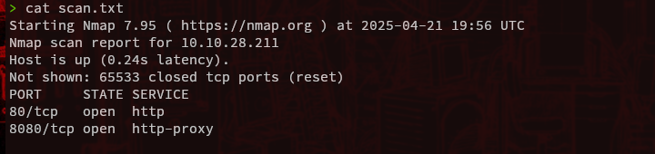

In 8080:

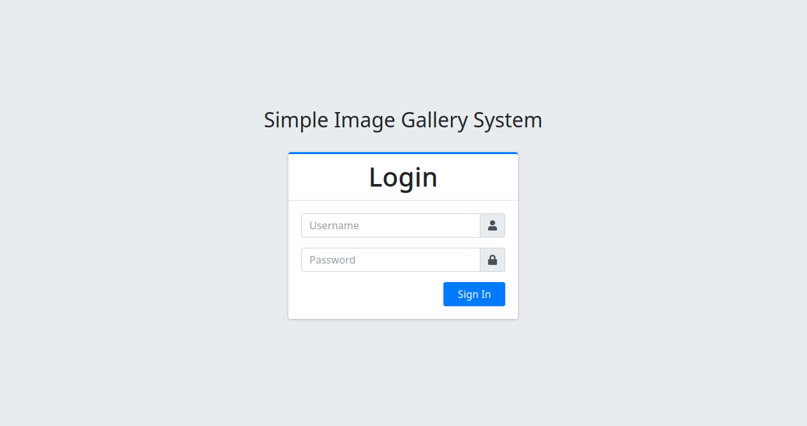

We search some dirs but no nothing interesting:

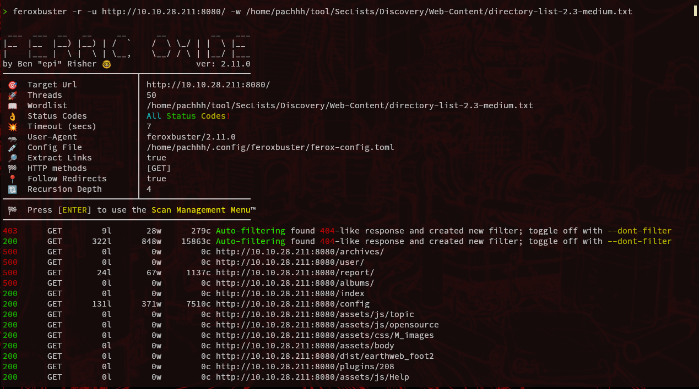

So in the login panel I caputured the request

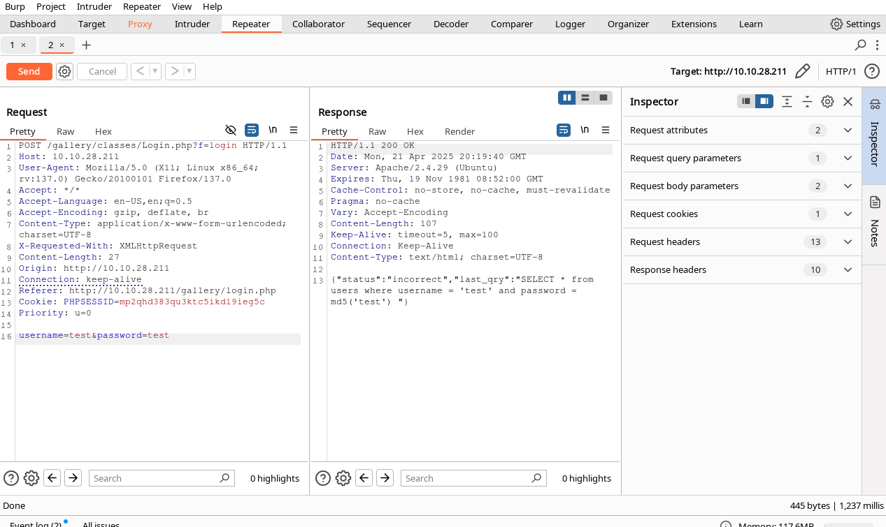

Unsafe response... 

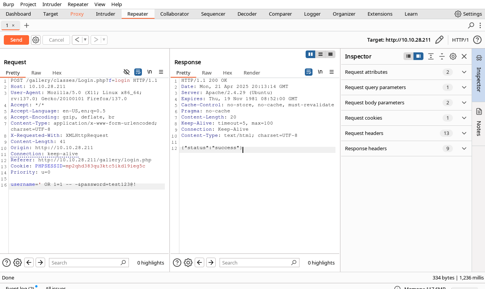

Now we are inside

We can see some interesting things

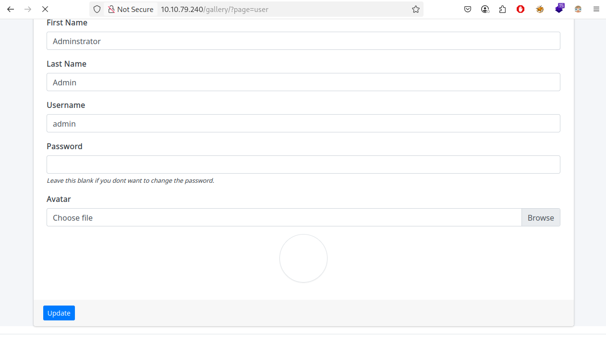

We can upload an avatar, I try upload my reverse shell php

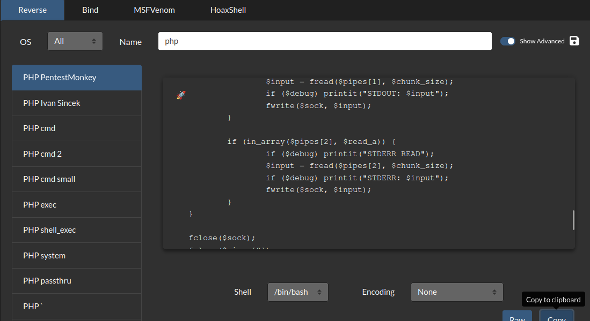

Later of upload and update, we can get connection in our listener 

Now inside, we can see the gallery directory and: 

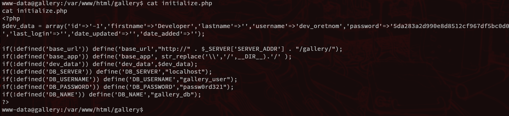

So: 

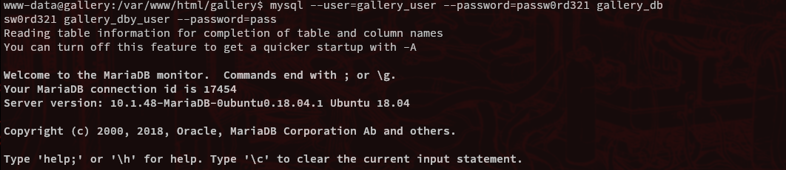

Here are the hash administrator:

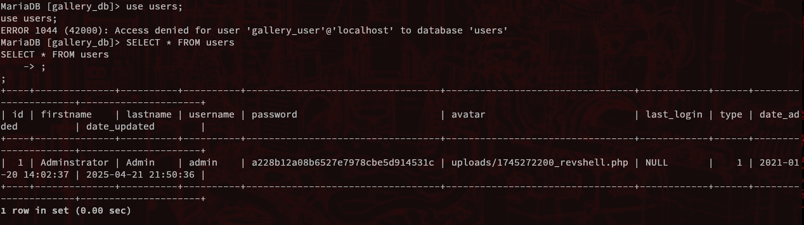

Later of trying decrypt this hash. i didn't but I found this backup of the user mike:

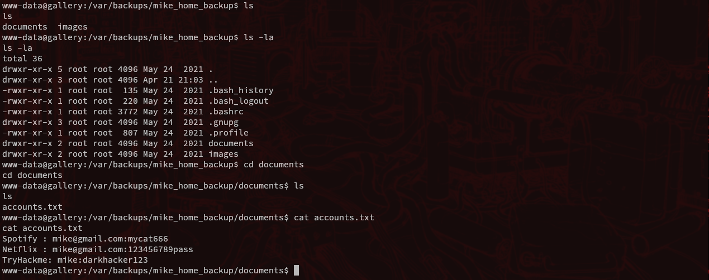

Interesting.. but this passwords not work. Anyway, the password are in the .bash_history

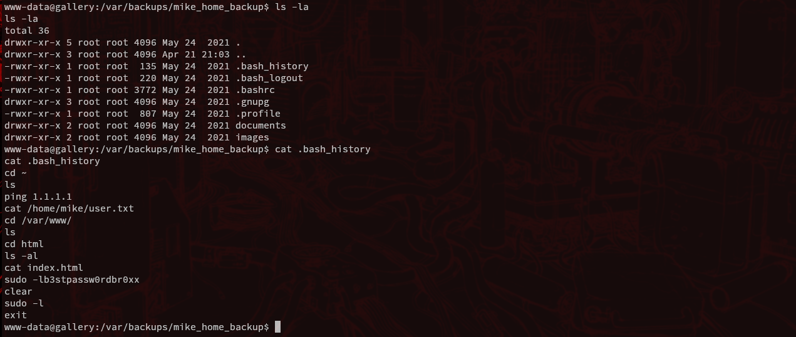

Now we are the user Mike and we can get the user.txt

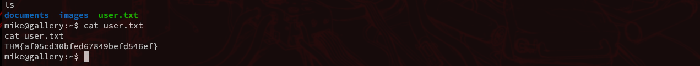

Now we try be root, so run the command: sudo -l and detect a very strange .sh

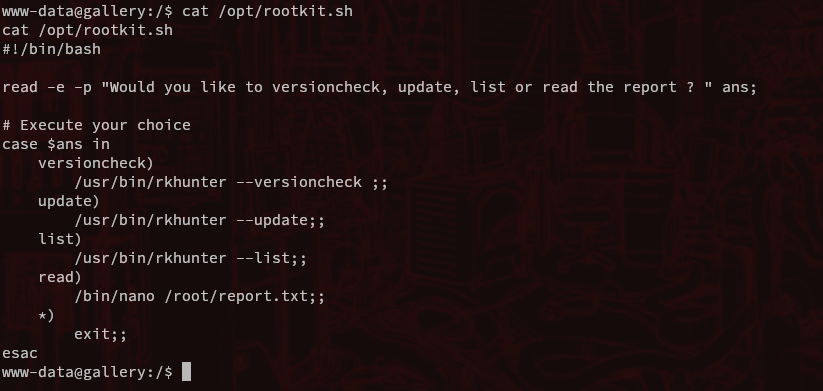

we can run /bin/nano like sudo 

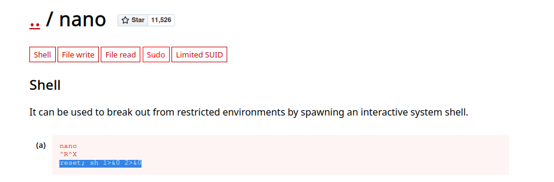

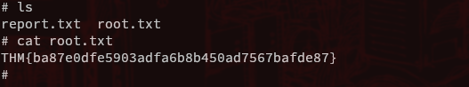
